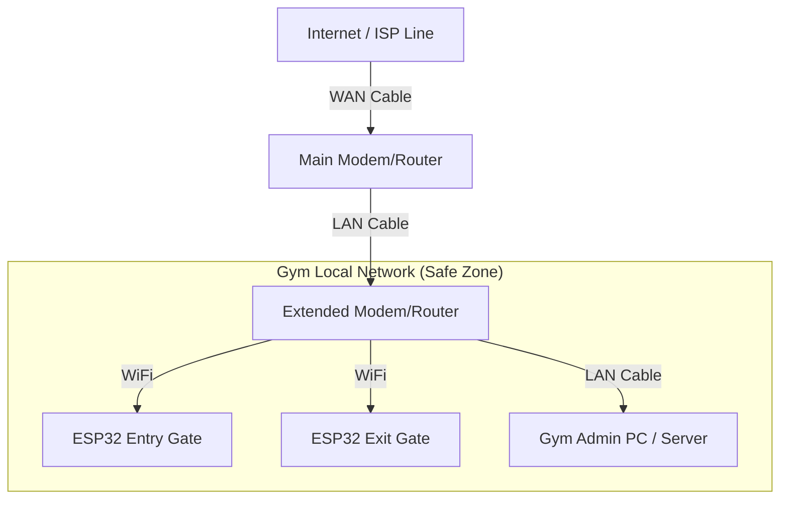

# Gate System Technical Documentation

## 1. Network Architecture (Your Setup)

This section confirms your specific network plan and explains why it is robust.

### The Topology


### 🔴 Critical Question: "If Internet stops, does the network exist?"
**YES. Your system WILL continue to work perfectly.**

Here is why:
1.  **The "Extended Modem" creates the Network:** Your Extended Modem acts as the "Captain" of the local network. It assigns IP addresses (DHCP) to your PC and ESP32s.
2.  **Traffic Flow:** When an ESP32 scans a card, it sends data to your PC's IP address. This conversation happens **inside** the Extended Modem. It never needs to go out to the Main Modem or the Internet.
3.  **Internet is just a "Feature":** Internet is like ordering pizza. If the pizza place is closed (No Internet), your house (Local Network) doesn't disappear. You can still talk to people in the other room (PC talking to ESP).

**Requirement:** Ensure your PC has a **Static IP** from the Extended Modem so the ESP32s always know where to find it.

---

## 2. Hardware Components

### A. ESP32 Controller ( The Brain )
*   **Model:** ESP32 Development Board (e.g., ESP32-WROOM-32).
*   **Role:** Connects to WiFi, controls the RFID scanner, and sends signals to the Relay module.
*   **Power:** 5V Micro USB or Vin pin.

### B. RFID Scanner
*   **Model:** RC522 (High Frequency 13.56 MHz).
*   **Connection:** SPI Interface (SDA, SCK, MOSI, MISO, RST).
*   **Range:** ~2-4 cm.

### C. Motors & Gates
*   **Type:** Solenoid Lock (for doors) OR Tripod Turnstile (Motorized).
*   **Control:** The ESP32 cannot power a motor directly. It uses a **Relay Module**.
*   **Relay Module:** A switch that ESP32 turns ON/OFF.
    *   **ESP32 Pin -> Relay IN**
    *   **Relay COM/NO -> Motor Power Circuit**

---

## 3. Wiring Diagram (Conceptual)

```
[ ESP32 ]                       [ Relay Module ]           [ Electronic Lock/Gate ]
|                               |                          |
| GPIO 4  --------------------> | IN1                      | (+) Power
| GND     --------------------> | GND                      |
| 3.3V/5V --------------------> | VCC          [COM] ----> |------------------ ( Power Source + )
|                               |              [NO]  ----> |------------------ ( Lock Terminal A )
|                               |                          |                   ( Lock Terminal B ) --> ( Power Source - )
```

---

## 4. Operational Logic

1.  **Scan:** Member touches card to RC522.
2.  **Send:** ESP32 sends HTTP POST request to PC:
    `http://192.168.1.100/gym-management/api/gate.php?gate_id=ENTRY_01&uid=A3B4C5D6`
3.  **Process (PC):**
    *   PHP Script (`gate.php`) checks Database.
    *   Verifies Member exists + Membership Active + Not Expired.
    *   Logs the entry in `gate_activity_log`.
    *   Returns JSON: `{ "status": "allowed", "open_delay": 3000 }`
4.  **Action (ESP32):**
    *   If `allowed`: ESP32 turns Relay ON (High).
    *   Waits 3000ms (3 seconds).
    *   Turns Relay OFF (Low).

---

## 5. Troubleshooting Network

If the "Extended Modem" loses connection to "Main Modem":

*   **Result:** You cannot browse Google/Facebook on the Gym PC.
*   **Gym System:** **STILL WORKS.** The ESP32 can still reach the PC because they are physically connected to the same box (Extended Modem).

**Only Failure Point:** If the **Extended Modem ITSELF** loses power or breaks, then the ESP32s cannot talk to the PC.
